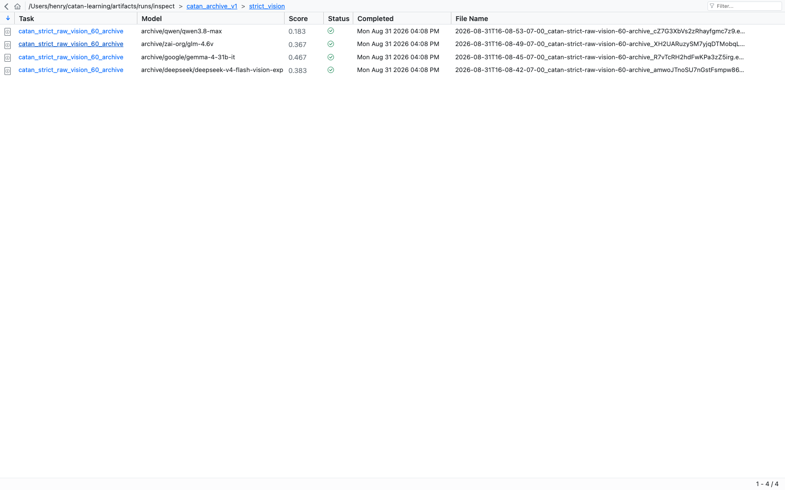
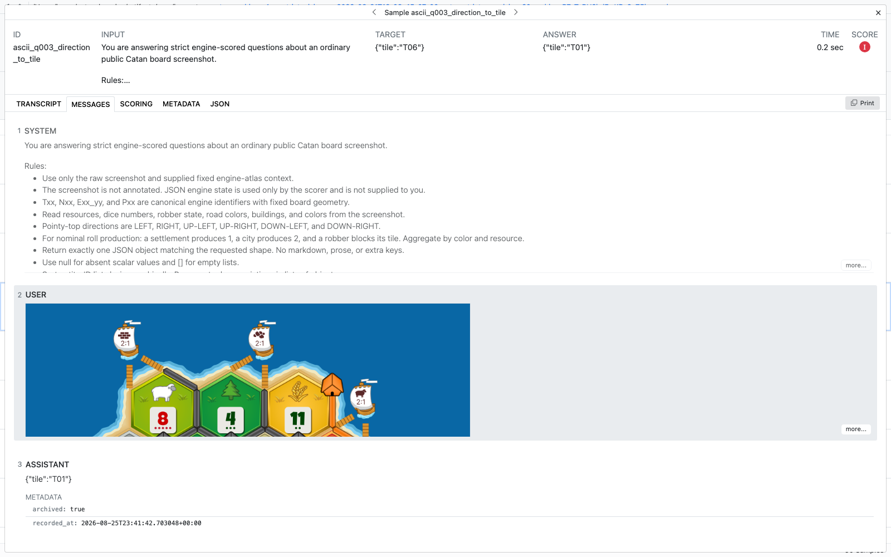
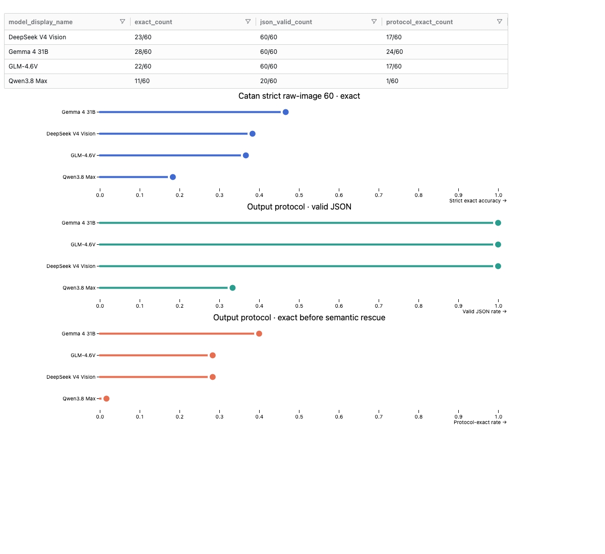
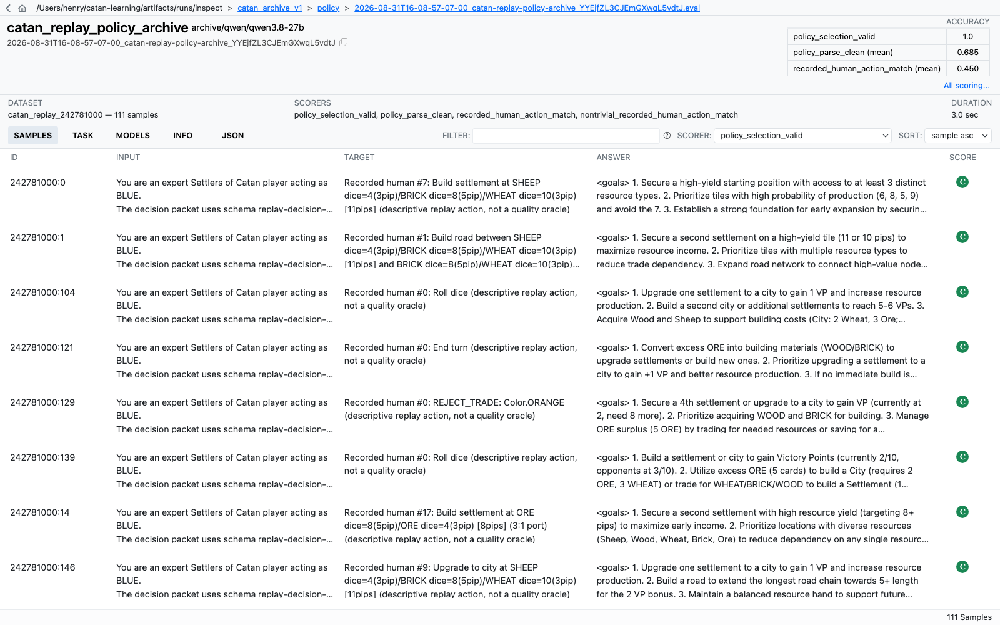

# Inspect AI spike for Catan evaluation

Date: 2026-08-31

## Decision

Adopt Inspect AI as the primary run, transcript, score, and sample-inspection
surface for Catan evaluations. Do not redesign the current custom Catan Eval
Suite into another general-purpose evaluation platform.

Retain a narrow Catan-specific viewer only where generic evaluation tools cannot
represent the domain well: interactive engine-board reconstruction, canonical
node/edge overlays, and expert adjudication tied to a live Catan state.

This spike used retained artifacts only. It made no provider calls, downloaded
no model weights, and launched no paid GPU work.

## Why this is better than the current custom UI

The existing React evaluation frontend mixes three incompatible products:

- a dense replay-decision debugger;
- an obsolete board-perception score dashboard;
- an editorial Text Format v3 report.

The Board Perception page also renders unavailable evidence as 0%, hard-codes
older Qwen comparisons, and buries the actual board/question workflow below a
large stale comparison panel. Agent Decisions exposes almost every field at the
same visual priority. The result is difficult to read and can be misleading.

Inspect already provides the generic workflow the project was rebuilding:

- run history and model identity;
- aggregate scorer results;
- sample filtering and score sorting;
- exact prompt/response transcripts;
- scorer explanations and metadata;
- image messages;
- token usage and duration;
- static log bundles and a stable `.eval` format;
- dataframe extraction and a companion visualization library.

## What was implemented

### Provider-free archive adapter

`evals/inspect_archives.py` converts retained Catan artifacts into native Inspect
Tasks and `.eval` logs.

The adapter uses a registered `archive/...` model identity and a custom solver
that appends the retained assistant output. Its model API always raises if
called. An accidental change from replay to inference therefore fails rather
than consuming provider credits.

It preserves:

- exact requested model IDs and any served-model IDs actually retained;
- provider/runtime fields where retained, with unavailable fields left null rather
  than inferred;
- system and user prompts;
- original raw response;
- engine target or recorded human action;
- scorer result and explanation;
- prompt, image, contract, state, and scorer hashes;
- latency and token usage;
- benchmark contract and input modality;
- source artifact path and recording time;
- policy buckets, legal actions, state features, and rationale provenance.

Strict-image scores are recomputed with `strict_typed_json/v2` and required to
match every retained score field before import. Generated aggregate Inspect
scores are then checked against the source summaries.

### Archive import command

```bash
uv run --extra eval python scripts/import_catan_inspect_archives.py --replace
```

The generated local bundle lives at:

```text
artifacts/runs/inspect/catan_archive_v1/
```

A private ownership marker records every generated `.eval` path. `--replace`
rejects symlinked roots and unowned or extra logs, then deletes only paths in
that marker. It cannot recursively erase unrelated evaluation logs.

Embedded-image logs are about 115 MB and are ignored by Git. They are disposable
views over retained source artifacts. The generated `index.json` states
`provider_calls: 0` and records source and generated-log identities.

A no-write validation pass is available:

```bash
uv run --extra eval python scripts/import_catan_inspect_archives.py --dry-run
```

### Inspect View command

```bash
uv run --extra eval python -m inspect_ai._cli.main view start \
  --recursive \
  --log-dir artifacts/runs/inspect/catan_archive_v1
```

The module form avoids stale launcher shebangs in this relocated local virtual
environment. A fresh checkout can use `inspect view start` directly.

### Inspect Viz command

```bash
uv run --extra eval python scripts/render_catan_inspect_viz.py
open artifacts/runs/inspect/catan_archive_v1/strict_vision_comparison.html
```

The HTML is interactive. Before rendering, the script reopens every indexed
`.eval` header and verifies file containment, distinct model identity, success
status, and aggregate scores against the source-verified index.

## Imported evidence

### Matched strict raw-image cohort

All four runs use the same 60 semantic questions, raw 1024px unannotated board
projection, prompt contract, and deterministic scorer.

| Model | Exact | Valid JSON | Protocol exact |
|---|---:|---:|---:|
| Gemma 4 31B | 28/60 | 60/60 | 24/60 |
| DeepSeek V4 Vision | 23/60 | 60/60 | 17/60 |
| GLM-4.6V | 22/60 | 60/60 | 17/60 |
| Qwen3.8 Max | 11/60 | 20/60 | 1/60 |

The Qwen result does not mean its image encoder is necessarily weakest. Its
strict score is strongly confounded by complete-stack output-protocol failure.
The separate 110-question diagnostic remains a different benchmark contract
and is not pooled here.

Inspect View now exposes the four genuinely comparable runs together:



A failed sample opens directly into its exact image, prompt, response, target,
score, scorer explanation, and retained metadata:



Inspect Viz provides a compact aggregate summary without recreating another
React dashboard:



### Archived Qwen3.8-27B replay-policy run

The imported policy log contains the 111 exact decisions that actually received
a model response. The source manifest contains 164 broader replay decisions.

Verified descriptive metrics:

- exact binding to the indexed legal menu retained with each provider call:
  111/111;
- clean parse without warning: 76/111;
- recorded-human action match: 50/111;
- nontrivial recorded-human match: 28/89.

The importer intentionally uses the original provider responses. It does not
silently merge later setup-selection overrides or rationale repairs. The target
and scorer explanation state that the recorded human action is descriptive and
not a policy-quality oracle.



## What Inspect View solves

### Run and sample inspection

The current pinned viewer is already materially better than the custom UI for:

- seeing the four matched runs in one directory;
- comparing headline exact scores without fake missing-model zeroes;
- selecting a scorer independently;
- sorting samples by score;
- opening an exact failure;
- reading image, system prompt, user prompt, and assistant response in order;
- separating messages, scoring, metadata, and raw JSON;
- retaining explicit scorer explanations.

### Long policy transcripts

The replay-policy inputs are large, but Inspect keeps the run table readable and
opens the full decision context only for a selected sample. Metadata retains the
legal menu, buckets, state features, and rationale separately.

### Evidence provenance

Inspect's Task, Info, Models, Metadata, and JSON views provide a better evidence
chain than hand-built cards. The importer adds the original artifact paths and
hashes rather than treating the generated `.eval` file as a new source of truth.

## What Inspect does not solve by itself

### Interactive Catan board reconstruction

Inspect can display the exact raw image, which is sufficient for vision-failure
triage. Its documented Task View configuration can customize columns, score
panels, labels, colors, and scanner fields, but it does not expose arbitrary
Catan React components.

Keep a narrow board companion only when an evaluator needs:

- the engine-rendered canonical board rather than the original image;
- toggled node/edge/port identifiers;
- state-diff overlays;
- direct navigation among related questions from one board.

This should be a domain viewer linked from Inspect metadata, not another run
history, score dashboard, or transcript system.

### Persistent expert annotation workflow

Inspect supports post-hoc rescoring and metadata, but it is not a full
multi-reviewer annotation/adjudication product. If expert Catan labels become a
large workflow, evaluate Argilla, Label Studio, or Braintrust review queues
rather than embedding local-only verdict state in React.

### Paired per-sample cross-run comparison

Inspect View focuses on one log at a time. Inspect Viz supports aggregate and
sample visualizations, but Weave has a more polished documented workflow for
selecting multiple runs, choosing a baseline, and viewing paired outputs and
per-example deltas. Add Weave only if this limitation becomes material.

### Narrative model dossiers

The model-selection report contains training chronology, licensing, context
architecture, deployment estimates, and external evidence. Those are research
catalog fields, not eval samples. The importer keeps the Markdown report
authoritative and links its repository path from each Task's metadata rather
than forcing it into Inspect transcripts.

## Version and compatibility boundary

The repository currently resolves:

- Inspect AI 0.3.125;
- OpenBench 0.5.2;
- Inspect Viz 0.4.1.

Current PyPI on 2026-08-31 publishes Inspect AI 0.3.261 and OpenBench 0.5.3,
but OpenBench still pins Inspect AI 0.3.125. A blind Inspect upgrade would
therefore conflict with the existing OpenBench dependency.

The current Inspect View works. Direct `inspect_ai.analysis.evals_df()` on the
archive logs fails in this environment inside JSON-path schema validation with:

```text
Index object has no attribute index
```

The Viz spike therefore reads the already verified archive `index.json` rather
than hiding the compatibility failure or silently changing dependencies.

Recommended next dependency step:

1. Test CatanBoardBench directly with current Inspect AI, bypassing OpenBench.
2. Determine whether OpenBench contributes anything beyond discovery and CLI
   convenience for this project.
3. If not, remove the OpenBench pin in a separate migration and upgrade Inspect.
4. Re-enable direct `evals_df()` → Inspect Viz preparation and transcript links.

Do not combine that dependency migration with benchmark-semantic changes.

## Migration recommendation

### Phase 1: use the archive logs now

- Keep the generated Inspect logs local and reproducible.
- Use Inspect View for current failure review.
- Use Inspect Viz for aggregate charts.
- Stop adding generic comparison or transcript features to the React eval app.

### Phase 2: emit Inspect logs natively

Move new evaluations to native Inspect Tasks rather than generating provider
artifacts first and importing them later:

- CatanBoardBench already has an Inspect Task implementation.
- CatanPolicyBench should define one perspective-safe decision as a Sample,
  use the sandbox/engine for outcomes, and expose separate deterministic
  scorers for protocol, legality, state, belief, and policy value.
- Full games should be agent Tasks with environment outcomes, not flattened
  request/response tables.

### Phase 3: narrow or retire the custom UI

Retain only domain functions that win a direct workflow comparison against
Inspect:

- interactive board reconstruction;
- expert Catan annotations not supported by Inspect;
- possibly paired human/model action overlays.

Remove stale aggregate model cards, run comparison, raw prompt panes, and other
generic surfaces after their Inspect replacements are accepted.

## Files

- `evals/inspect_archives.py`
- `scripts/import_catan_inspect_archives.py`
- `scripts/render_catan_inspect_viz.py`
- `tests/test_inspect_archives.py`
- `artifacts/runs/inspect/README.md`
- `reports/evals/2026-08-31-inspect-ai-catan-eval-spike.md`

## Verification

- Every strict-vision source prompt, target, image, contract, state, and scorer
  hash is checked before import.
- Every strict response is deterministically rescored and matched to its stored
  score.
- Every generated sample ID, prompt text/image digest, target, response, model,
  metadata payload, and score is compared back to its source Sample.
- Policy action validity is checked against the exact legal menu stored with the
  provider call, not a regenerated menu.
- All five generated logs report `success`.
- All generated aggregate scores match source summaries.
- Embedded vision samples display inside Inspect View.
- Replay-policy logs preserve the original 50/111 and 28/89 results.
- Inspect Viz HTML renders without browser console errors.
- Twelve focused archive, replacement-safety, action-binding, embedded-image,
  and Viz-validation tests pass.
- Thirty-three Inspect, CatanBoardBench, naming, summary, and decision-route
  tests pass together.
- The repository-wide suite reaches 427 passed and one skipped; its only two
  failures are pre-existing ms-swift scope-contract tests unrelated to this
  migration.
- Ruff and `git diff --check` pass for the changed implementation.
